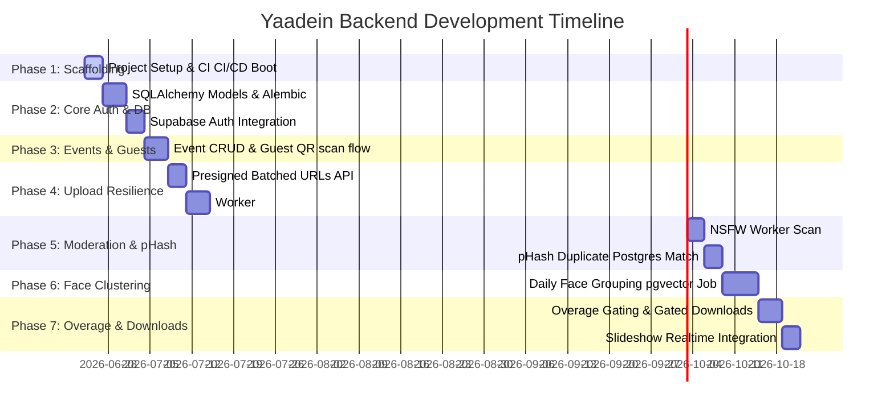

# Backend Implementation Plan & Folder Structure — Yaadein

This implementation plan details the phase-wise backend development timeline and a production-level folder structure optimized for containerization, Docker layer caching, and CI/CD pipelines.

---

## Production-Level Folder Structure

```
yaadein-backend/
├── .github/
│   └── workflows/
│       ├── test.yml            # CI: linting, type checks (mypy), unit & integration tests
│       └── deploy.yml          # CD: builds Docker image, deploys to ECS/App Runner/K8s
├── .dockerignore
├── .gitignore
├── Dockerfile                  # Multi-stage Dockerfile (can run as API server or Celery worker)
├── docker-compose.yml          # Local development stack (FastAPI, Redis, Postgres, MinIO)
├── pyproject.toml              # Dependency and project metadata (Poetry/Rye)
├── README.md
├── alembic.ini                 # Alembic migrations configuration
├── src/
│   ├── __init__.py
│   ├── config.py               # App configuration (Pydantic Settings from env variables)
│   ├── database.py             # SQLAlchemy engine and session pool configuration
│   ├── main.py                 # FastAPI application entrypoint and middleware
│   ├── api/
│   │   ├── __init__.py
│   │   ├── deps.py             # Common dependencies (get_db, get_current_user)
│   │   └── v1/
│   │       ├── __init__.py
│   │       ├── auth.py         # Login, token issuance, password resets
│   │       ├── events.py       # Event CRUD and settings
│   │       ├── uploads.py      # Batched presigned URLs and upload confirmations
│   │       ├── gallery.py      # Live gallery feeds and cached payloads
│   │       ├── albums.py       # Custom static/dynamic face-cluster albums
│   │       └── downloads.py    # Gated download URLs and ZIP exports
│   ├── models/                 # SQLAlchemy ORM Models
│   │   ├── __init__.py
│   │   ├── user.py
│   │   ├── event.py
│   │   ├── guest.py
│   │   ├── media.py
│   │   ├── face.py             # consents, clusters, and pgvector embeddings
│   │   ├── album.py
│   │   └── payment.py
│   ├── schemas/                # Pydantic validation schemas (request/response models)
│   │   ├── __init__.py
│   │   ├── user.py
│   │   ├── event.py
│   │   ├── upload.py
│   │   ├── media.py
│   │   └── album.py
│   ├── services/               # Core business logic / third-party service integration
│   │   ├── __init__.py
│   │   ├── auth.py             # Hashing, token cryptography
│   │   ├── storage.py          # Cloudflare R2 client (presigning, uploads)
│   │   ├── moderation.py       # AWS Rekognition API client
│   │   └── images.py           # Thumbnail downscaling and pHash generation
│   ├── workers/                # Celery worker application
│   │   ├── __init__.py
│   │   ├── app.py              # Celery app initialization and Redis configuration
│   │   └── tasks/
│   │       ├── __init__.py
│   │       ├── media.py        # Image processing, NSFW scanning, pHash checking
│   │       ├── video.py        # Video transcoding and moderation scanning
│   │       └── face.py         # Daily face clustering cron jobs
│   └── migrations/             # Database migration scripts (Alembic)
│       ├── env.py
│       ├── script.py.mako
│       └── versions/           # Schema migration history files
└── tests/                      # Pytest suite
    ├── __init__.py
    ├── conftest.py             # Shared fixtures (mock R2, test DB sessions)
    ├── api/
    │   ├── test_auth.py
    │   └── test_uploads.py
    └── workers/
        └── test_media.py
```

### Why this is CI/CD Optimized:
1. **Single Multi-stage Dockerfile**: We build a single base Docker image containing all dependencies and source code. In production, we deploy this identical image twice:
   - Command `uvicorn src.main:app` for the API container.
   - Command `celery -A src.workers.app.celery_app worker` for the background worker.
   - This ensures development parity and speeds up CI/CD build pipelines through Docker layer caching.
2. **Migrations Package**: Alembic migrations live inside `src/migrations`. This allows the CI/CD pipeline to easily trigger migrations (e.g., `alembic upgrade head`) as a release/pre-deploy hook in ECS/K8s before spinning up new API containers.
3. **Environment-Driven Configuration**: All settings are loaded via `Pydantic Settings` from environment variables, keeping configurations isolated from code for easy integration with AWS SSM/GCP Secrets Manager.

---

## Phase-Wise Implementation Plan



### Phase 1: Project Scaffolding & CI/CD Setup
- Initialize pyproject.toml (FastAPI, SQLAlchemy, Celery, Pytest, Pillow, ImageHash, pgvector, boto3).
- Configure local stack in `docker-compose.yml` (Postgres with pgvector, Redis, MinIO as mock R2).
- Setup GitHub Actions configuration for automatic linting (`ruff`), type checking (`mypy`), and pytest runner.
- Create multi-stage `Dockerfile`.

### Phase 2: Database Models & Supabase Auth Integration
- Implement database models based on [schema.sql](file:///e:/Projects/Yaadein/docs/schema.sql), ensuring correct declarative hash-partitioning and composite keys.
- Configure Postgres triggers to sync Supabase `auth.users` additions to our public `users` profiles automatically.
- Write Alembic migrations (including public schema and triggers).
- Implement FastAPI middleware/dependencies to verify Supabase JWT tokens via local signature check, extracting the user ID and role for route authorization.

### Phase 3: Event & Guest Registration Flow
- Implement Event endpoints (CRUD, branding metadata, toggle features).
- Implement Guest registration endpoint: scanned QR code invokes a lightweight name-capture form, writing to the `guests` table to generate a local session ID.

### Phase 4: R2 Integration & Upload Resilience
- Write Cloudflare R2 connection client in `services/storage.py` handling batched multipart presigning.
- Implement `POST /api/v1/uploads/presign` (dynamically partitions files >10MB into chunks).
- Implement `POST /api/v1/media/confirm` (backend-side R2 `HEAD` check, creates initial database record).
- Implement Celery image processing worker tasks: downloads image, downscales into a **400px thumbnail** (public path) and a **1600px preview** (public path), uploads both to R2.

### Phase 5: Moderation & Perceptual Duplicate Detection (pHash)
- Integrate NSFW moderation scanning inside the Celery task (AWS Rekognition client wrapper).
- Implement 64-bit pHash calculator using the `ImageHash` library.
- Implement Postgres bitwise Hamming distance query in SQLAlchemy using `#` and `bit_count`.
- Handle state transitions: mark media as `'visible'` if clean, `'rejected'` if unsafe, or `'duplicate'` if visually identical to an existing event image.

### Phase 6: Face Recognition & Custom Albums
- Implement face consent checkbox registration flow.
- Setup background face grouping task: extracts face templates/embeddings (using insightface/dlib), saves float vectors into the partitioned `face_embeddings` table.
- Build face clustering logic (daily schedule/cron job) using DBSCAN or k-means, saving outputs to the `face_clusters` table.
- Implement endpoints for custom static albums (selecting media IDs) and dynamic saved-filter albums (selecting face cluster IDs).

### Phase 7: Access Control, Overage, and Realtime Slideshow
- Configure private bucket permissions for high-res original photos.
- Implement `GET /api/v1/media/:id/download` endpoint with overage checks (creation-order logic), redirecting users to temporary presigned R2 URLs.
- Implement async ZIP generation task via Celery.
- Enable Supabase Realtime replication on the partitioned `media` tables to push live gallery additions to the frontend.

---

## Verification Plan

### Automated Testing (CI)
- **Unit Tests**:
  - Test Supabase JWT token verification middleware.
  - Test batch URL chunking logic based on mock input file sizes.
- **Integration Tests**:
  - Test Postgres hash partitioning constraints by running concurrent writes of media rows containing same IDs but different event keys.
  - Run mock uploads using LocalStack/MinIO and verify image resizing and pHash distance matching.

### Manual Verification
- Deploy local compose stack, upload identical files using curl/scripts, and assert correct insertion into the database partition tables.
